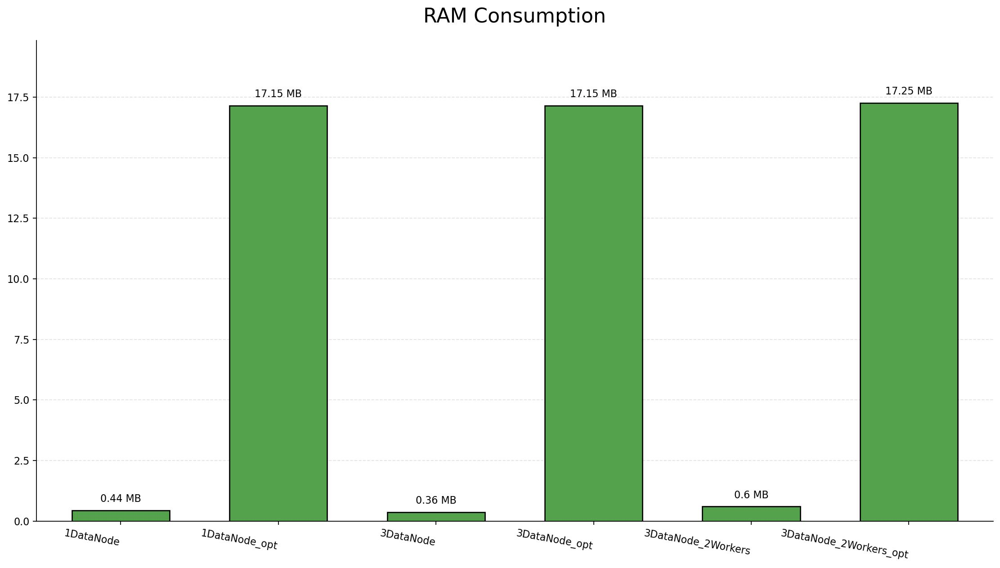
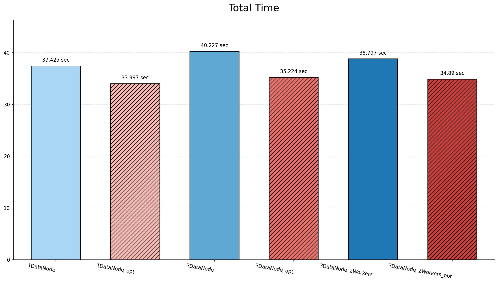
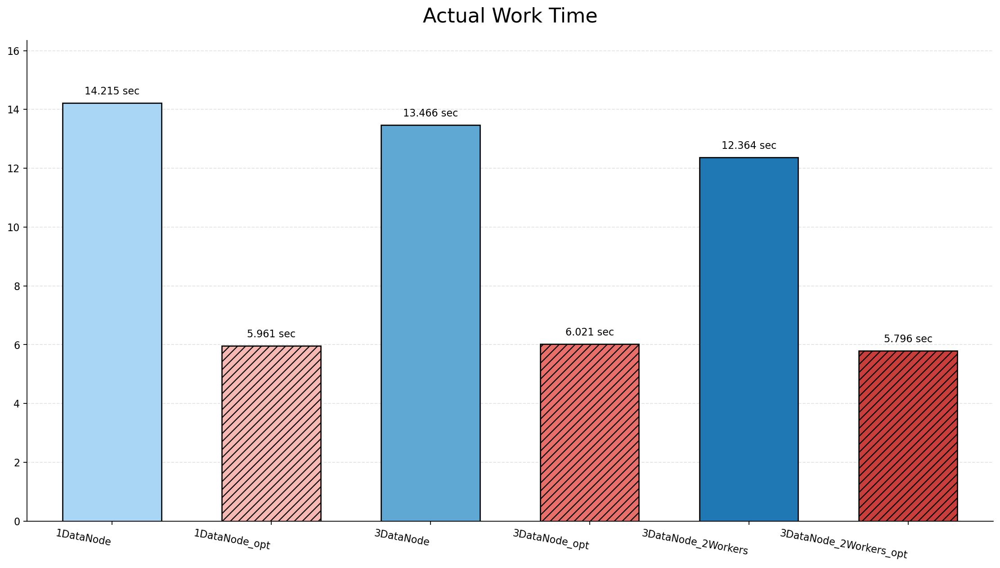
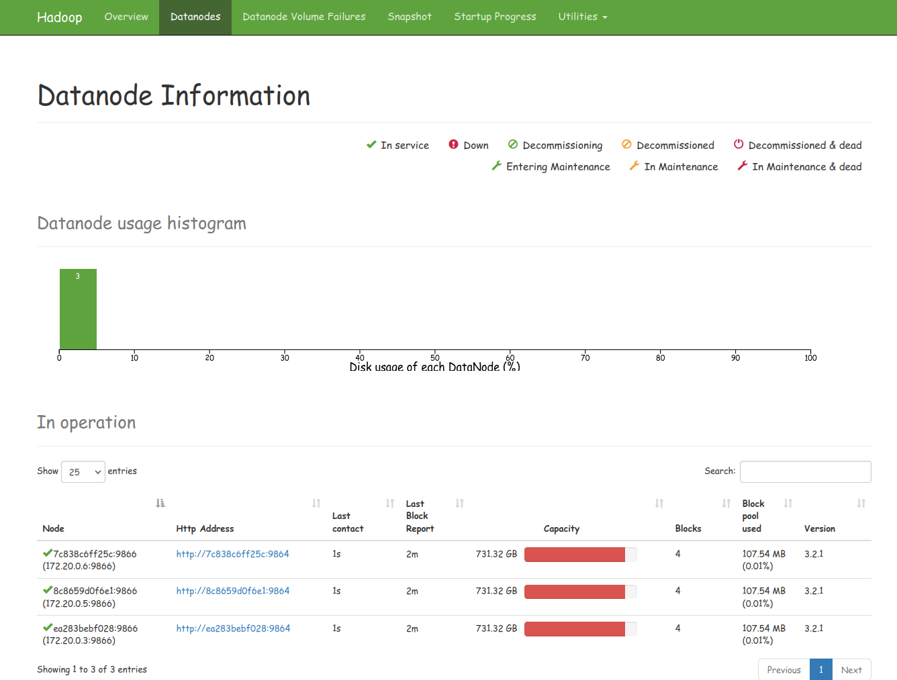
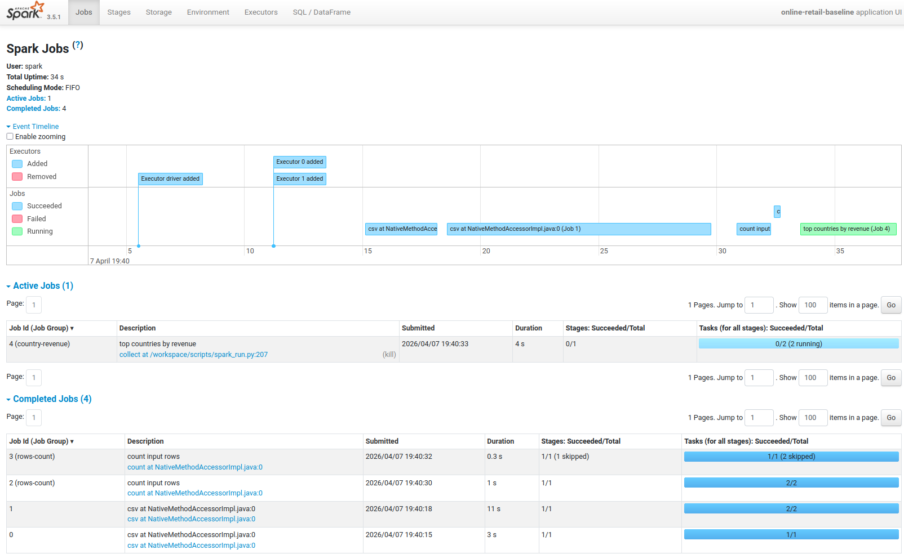

# Hadoop/Spark Lab

## TLDR

```bash
# Программа интерактивная, придётся 6 раз нажать <Enter> в процессе, когда попросят.
/bin/sh test.sh all
```


## Датасет

В работе используется датасет "Online Retail II", логика загрузки в [scripts/preprocess_dataset.py](./scripts/preprocess_dataset.py), скрипт скачивает датасет если его нет в виде xlsx-файла, переводит его в csv и кидает в `./data`. Датасет содержит 1,067,371 записей и 9 переменных:
- Invoice -- счёт (по сути число -- number)
- StockCode -- какой-то код (число и возможно буква -- string)
- Description -- string
- Quantity -- number
- InvoiceDate -- какая-то дата -- date
- Price -- number
- Customer ID -- string
- Country -- category
- SourceSheet -- какой-то промежуток годовой, очень часто повторяется -- category


## Docker

Для Hadoop подготовлены три конфигурации:
- docker-compose_1DataNode.yml
- docker-compose_3DataNode.yml
- docker-compose_3DataNode_2Workers.yml

Для Spark -- две:
- scripts/spark_run.py -- без оптимизации
- scripts/spark_run_opt.py -- с оптимизацией


## Как работает?

Постарался всё автоматизировать, нужно будет только самому установить docker compose и пакеты через pip: matplotlib и pyspark. Основная логика в `test.sh` -- там запускается 6 экспериментов:
- 1DataNode, Spark без оптимизации, 1Worker
- 1DataNode, Spark с оптимизацией, 1Worker
- 3DataNode-ы, Spark без оптимизации, 1Worker
- 3DataNode-ы, Spark с оптимизацией, 1Worker
- 3DataNode-ы, Spark без оптимизации, 2Worker-а
- 3DataNode-ы, Spark с оптимизацией, 2Worker-а


## Логи

Можно посмотреть в папке logs. Там так же лежат скриншоты веббраузера и графики. Но в README.md тоже их посмотрим.


Как видно, оперативной памяти в случае использования оптимизаций кушается гораздо больше. Подозреваю, что разница между потребляемой памятью без использования оптимизация и при их использовании падает при увеличении общей потребляемой памяти (напр. при увеличении датасета), но это нужно проверять.


На графике с общим временем работы видно, что при использовании оптимизаций время работы немного сокращается, что удивительно, помню при первых тестах такого не было и время работы при оптимизациях было больше (т.к. начальное кеширование занимало оч много времени). Но если посмотреть на json файлы, там поиск стал действительно гораздо быстрее, поэтому общая тенденция ясна и так -- хеширование / индексирование / кэширование / подобные техники  занимают какое-то время (среднем materialize cached dataframe в экспериментах занимает 20 сек.), но дают большой прирост в скорости полезной работы с данными (с среднем от 5и до 9ти секунд как будет видно далее).


Время голой работы без учёта подготовки. Большой прирост при использовании оптимизаций. Использование трёх DataNode-ов тоже даёт прирост, но не в случае использования оптимизаций. Использование 2ух Worker-ов даёт прирост даже при использовании оптимизаций.


Можно посмотреть скришоты. Вот скриншот с тремя датанодами (эксперимент 3 дата ноды, без оптимизаций):


Есть скриншот, наглядно показывающий использование двух вокреров, интересно посмотреть:



# Итог

Интересная работа, оптимизации упрощают вычисления, Hadoop и Spark удобные инструменты, делают нашу жизнь проще.

Однако, оптимизация не прошла незаметной и сильно увеличилось потребление RAM. Из опыта могу сказать, что если датасет нужно часто обновлять и там будут накапливаться новые записи, подобную оптимизацию тоже придётся выполнять с определённой частотой, а ведь она ест не только RAM, но и занимает какое-то время. Поэтому на старых компьютерах у знакомых частенько отключаю индексирование томов :3